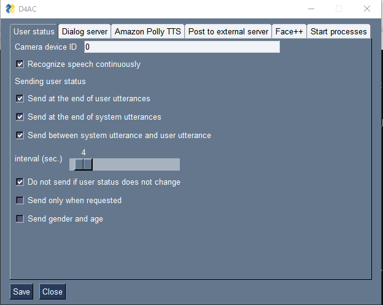
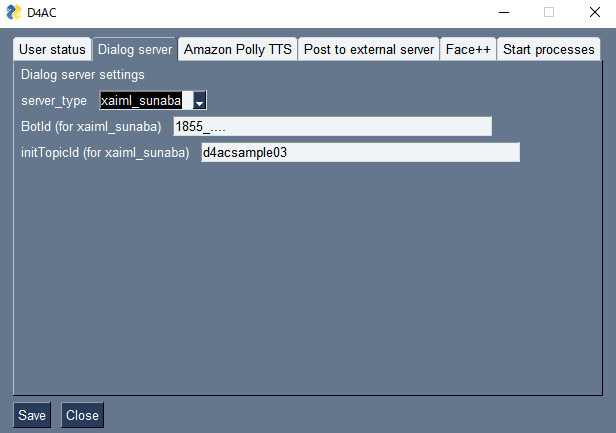
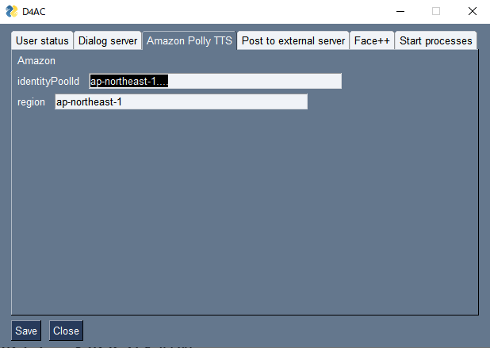
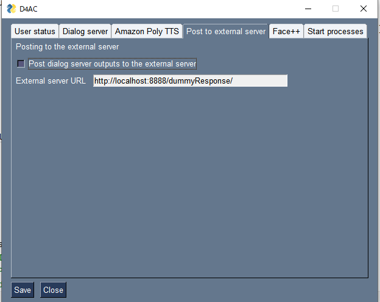
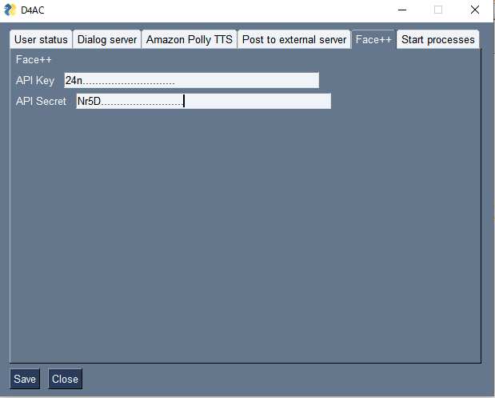
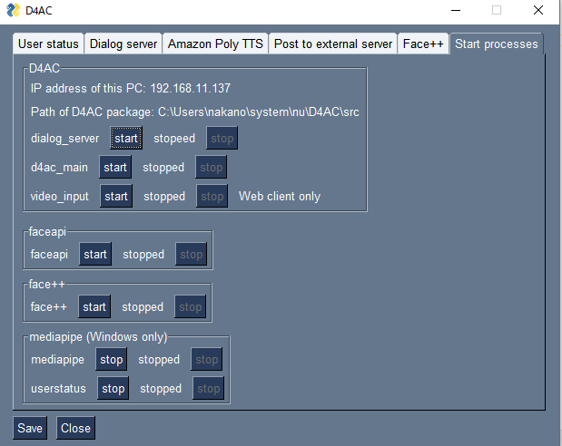
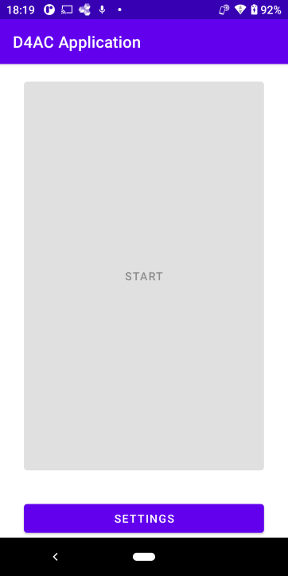
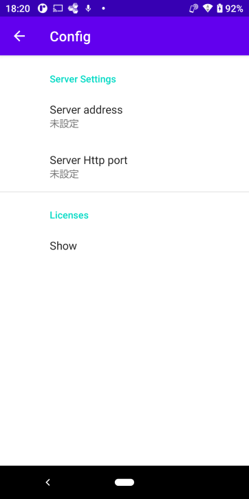

# D4AC: マルチモーダル対話システム構築ツール

ver 1.0.1

## 概要

D4AC (Dialogue for All-Client)は名古屋大学で開発されている，マルチモーダル対話システムを非専門家でも簡単に構築できるツール，D4A (Dialogue for All) のクライアント（マルチモーダル入出力部）です．

NTTドコモの[xAIML SUNABA](https://docs.xaiml.docomo-dialog.com/#) またはC4A研究所の[DialBB](https://github.com/c4a-ri/dialbb)を用いて構築・動作する対話サーバのクライアントとして動作します．

対話サーバとD4ACを動作させておき，D4ACが動いているのと同じPC上のChromeまたはAndroid端末からD4ACに接続して利用できます．（現在Android用のアプリは配布していません．必要な場合は開発者に相談してください）

ユーザの顔画像の認識結果から推定した対話参加度や，ユーザの状態に依存して動作を変更する対話システムを作成することができます．

 D4ACは以下の環境で動作確認を行っています．

- OS: Windows 10 Pro 64bit
  
  Python for Windows 3.9.9
  
  Google Chrome バージョン: 89.0.4389.114

- OS: Windows 11 Pro 64bit
  
  Python for windows 3.10.2
  
  Google Chrome バージョン：107.0.5304.107

- OS: Mac OS 12.6.1 (Apple M1)
  
  Python for Mac 3.9.10
  Goole Chrome  バージョン：107.0.5304.87
  

ユーザ状態推定結果推定のサービスとして，以下のサービスが利用できます．

- [Face++](https://www.faceplusplus.com/)に対応しています．
  - 対話参加度，年齢，性別，感情認識に対応しています．
- [Mediapipe FaceMesh](https://google.github.io/mediapipe/solutions/face_mesh)に対応しています．（Windowsのみ）
  - 対話参加度のみサポートしてます．

PCからChromeブラウザ経由で利用する場合，PCに接続できるカメラ・マイク・スピーカは一般的なものを用いることができます．

androidのアプリの場合は，モニタ前面のカメラ，内蔵マイク，スピーカーを使用します．

D4ACのインストールにはインターネット接続が必要です．

D4ACの技術的な詳細や変更の仕方については，[開発者ドキュメント](docs/developer-document.md)を参照してください．

## 注意事項

D4ACは、ユーザの顔画像や音声を民間企業が管理しているクラウドの画像認識，音声認識システムに送ります。そのため、個人情報漏洩のリスクがあります。D4ACを用いて構築したシステムを使ってもらう際には、ユーザにそのことを伝えたうえで、適切に同意を取るなどをしてください。

また、顔画像から感情を推定して、対話の内容と結びつけることは、使い方によっては、ユーザが意図的に開示していない個人の内面を得るリスクがある。この点に注意した使い方をしてください。

## インストール

D4ACをインストールするためには，pythonのインストール，パッケージのインストール，mosquittoのインストール，mosquittoの設定が必要です．

### pythonのインストール

pythonのインストール方法は，複数の方法があります．代表的なものを説明します．

- Windows
  
  - [https://www.python.org/downloads/windows/](https://www.python.org/downloads/windows/) から Python for Windowsをインストールします。
  
  - Python for Windows 3.9.9で動作確認をしているが，3.8以上であれば動く可能性があります。
  
  - インストール最初の画面の"Add Python 3.x to PATH" をチェックするのを忘れないようにしてください．
  
- Mac

  - brewのインストール
  - [https://brew.sh/](https://brew.sh/)などを参照してbrewをインストールします。
  
- pythonのインストール
  

macのpython3をbrewでインストールする.

  ```sh
  brew install python-tk
  ```

`python`ではなく，`python-tk`をインストールしてください．そうでないと，GUIが表示できません．

### D4ACパッケージのインストール

- whlファイルのダウンロード．

  - [D4ACのページ](https://github.com/nu-dialogue/D4AC) にある `d4ac-x.x.x-py3-none-any.whl` というファイルをクリックし開いたのち，右上の下向き矢印をクリックしてダウンロードしてください．ダウンロードした後，適当なフォルダに移動させてください．

- パッケージのインストール

  - コマンドプロンプト(macの場合はターミナル)を開き，whlファイルをおいたフォルダに移動し，次のコマンドを入力します．

  ```sh
  pip install <ダウンロードしたwhlファイルの名前> 
  ```

  - `<ダウンロードしたwhlファイルの名前> ` の部分はダウンロードしたwhlファイルの名前に置き換えてください．

  - pythonのインストール環境によっては，`pip`ではなく`pip3`の場合があります．

  - 上記のコマンドを入力すると，自動的に必要なパッケージをインターネットからダウンロードしてインストールします．

### mosquittoのインストール

ユーザ状態推定結果を使用した対話をするためにMosquittoというMQTTのサービスをインストールする必要があります．

 以下の手順に従って，mosquittoをインストールしてください．

- Windows の場合
  
  - [https://mosquitto.org/download/](https://mosquitto.org/download/) からWindows用バイナリをダウンロードしてください．
    - Binary InstallationのWindowsのところにあります．
    - 64-bit buildか32-bit buildかはお使いのコンピュータのOSに応じて選択してください．
  
  - ダウンロードしたファイルをダブルクリック開き，インストールしてください．すべてデフォルトを選ぶので構いません．

  Windows 10の場合，Ctrlキー，Altキー，Deleteキーを同時に押し，「タスクマネージャ」をクリックしてください．
  
  「サービス」というタブをクリックし，名前がmosquittoのところにカーソルを合わせ，右クリックし．「開始」を選んでください．

- macの場合
  
  以下の手順でインストールし，起動します．
  
  ターミナルを開きます．
  
  [brew](https://brew.sh/index_ja)をインストールしていない場合，インターネットよりインストールします．pythonのインストールの項を参照してください．
  
  インストール後，以下を実行します．
  
  ```sh
    brew install mosquitto
  ```
  
  以下のコマンドでmosquittoを起動します．
  
  ```sh
    /opt/homebrew/opt/mosquitto/sbin/mosquitto -c /opt/homebrew/etc/mosquitto/mosquitto.conf
  ```

### Androidを使用する場合のMosquittoの設定

Androidを使用する場合は，以下のようにMQTTの設定を変更してください．Windows の場合，`c:\program files\mosquitto\mosquite.conf`,macの場合は`/opt/homebrew/etc/mosquitto/mosquitto.conf` をテキストエディタ（メモ帳など）で開いて，以下を書き加えて保存ください．  

  ```txt
  listener 1883
  allow_anonymous true
  ```

## 起動

WindowsのコマンドプロンプトまたはMacのターミナルを開き，

```sh
d4ac
```

を入力すると設定画面を起動させることができます．どのディレクトリ（フォルダ）でも構いません．

windowsの場合，以下の手順でショートカットを作成して起動させることができます．

- 作成したいフォルダにて，右クリック→`新規作成`→`ショートカット`

- ショートカットのウィザード画面が表示されるので，項目の場所に`d4ac`と入力

- `次へ`をクリック，名前を適当に入力して`完了`をクリック．

そうするとショートカットが作成されるので，次回からはそのショートカットをダブルクリックすることにより実行できます．

### D4ACの設定画面

D4ACを起動すると，設定画面が表示されます．そこにて各種設定，システムの起動，終了をすることができます．

#### 共通項目

| ボタン | 説明 |
|-----|------|
| Save | 設定をyamlファイルに書き込みます．このボタンをクリックしないと設定内容は反映されません． |
| Close | プログラムを終了します．起動しているD4AC関連プログラムも終了します． |

#### User states タブ



| 項目 | 説明 |
|-----|------|
| Camera device ID | カメラのデバイスのIDを表す0以上の整数を入れます． |
| Recognize speech continuously | システム発話中も含め，音声認識を常時行う場合にチェックを入れます．スピーカーのシステム発話が認識される場合があるので，注意してください．androidアプリでは無効です． |
| Send at the end of user utterances |ユーザ発話の終了時にユーザ状態推定結果を送信します． |
| Send at the end of system utterances | システム発話の終了時にユーザ状態推定結果を送信します． |
| Send between system utterance and user utterance | システム発話が終わった後にユーザが一定時間発話しなかった場合に，ユーザ状態推定結果を送信します． |
| interval (sec.) | 上記の設定の場合のユーザ状態推定結果の送信タイミング（秒）|
| Do not send if user status does not change | 上記の場合に，ユーザ状態推定結果が変化しない場合は送信しないようにします． |
| Send only when requested | システム発話の終了時またはシステム発話が終わった後にユーザが一定期間発話しなかった場合にユーザ状態推定結果を送信する設定になっている場合，対話管理部からのリクエスト（システム発話と同時に送られてきます）にマッチしたときだけユーザ状態推定結果を送信します． |
| Send gender and age | ユーザ状態推定結果を送信する際に，性別と年齢の推定結果を送信する場合にチェックを入れます． |

#### Dialog serverタブ




| 項目 | 説明 |
|-----|------|
|server_type | サーバタイプを切り替えることができます．現在は`xaiml_sunaba`，`dialbb`，`dummy_dialog`, `test_dialog`が選べます（後述）． |
| Botid | sunabaを使用している場合のBotid |
| initTopicId | sunabaを使用している場合の初期topicid|

#### Amazon Polly TTSタブ

音声合成をAmazon Pollyを用いて行うための設定です．

identity PoolIdとregionを設定します。これらを取得するには、AWSのアカウントの取得と設定が必要で、その方法は[このページ](https://docs.aws.amazon.com/ja_jp/sdk-for-javascript/v2/developer-guide/getting-started-browser.html)に載っていますが、技術知識が必要なので、詳しい人に聞いてください。

今は日本人男性(Takumi)の声しか使えません。



| 項目 | 説明 |
|-----|------|
| identityPoolId | amazon pollyのidentityPoolId|
| region |  amazon pollyのregion|

#### Post to external serverタブ

対話サーバ処理結果を外部サーバに送信する設定を行います．



| 項目 | 説明 |
|-----|------|
| Post dialog server outputs to the external server | 対話サーバ処理結果を外部サーバに送信するかどうかのフラグ． |
| External server URL | 外部サーバ送信先URL|

#### Face++タブ



| 項目 | 説明 |
|-----|------|
| API key | Face++のAPI keyを入力します． |
| API Secret | Face++のAPI Secret入力します． |

Face++のAPI Key, API Secretの取得方法については，[ここ](docs/facepp.md)を見てください．

#### Start processesタブ

モジュールを起動します．



| 項目 | 説明 |
|-----|------|
| IP address of this PC | Androidアプリが接続するときのIPアドレスです．androidアプリで接続するときに参考にしてください．|
| Path of D4AC package | 実行しているD4ACパッケージの保存先パスです．対話中のイメージを保存するときに参考にしてください．|
| dialog_server | dialog_server（対話サーバ）を起動，終了します． |
| d4ac_main | d4ac_main（メインプログラム）を起動，終了します． |
| video_input | video_input（カメラ画像入力）を起動，終了します．Chromeの時のみ使用してください． |
| face++ | face++（Face++ ユーザ状態推定）を起動，終了します． |
| mediapipe | mediapipe（mediapipeユーザ状態推定）を起動，終了します．（windowsのみ使用可能） |
| userstatus | userstatus（mediapipeの結果から対話参加度を推定するモジュール）を起動，終了します． |

各プログラムを起動すると，画面上に`running`と表示されます．起動中のプログラムは`stop`ボタンで停止できます．

### システム起動

- Chromeを使用する場合

  設定画面のStart processesタブを選び，そこから必要なプロセスを起動してください．

  dialog_server, d4ac_mainは必ず起動してください．

  画像情報からユーザ状態推定を行う場合は， video_inputを起動し，さらに，face++， mediapipe (Windowsのみ)のどれかを起動してください．画像入力の画面が立ち上がるまでかなり時間がかかります（1分程度）

  mediapipeを用いる場合は，userstatusも起動してください．

  起動後，chromeを実行し，`http://localhost:8000/` に接続すると，画面にmenuが現れます．

  | 内容 | 説明 |
  |-----|------|
  |Chrome Speech Synthesis| Chrome音声合成を使用する音声対話モードになります．（最初はこれが選ばれています）|
  | Amazon Polly |Amazon Polly音声合成を使用する音声対話モードになります．|
  | Text IO |テキスト入出力のモードになります．|

  Utterance画面で「Start Dialog」をクリックすると対話が始まりますので，音声発話またはテキスト入力でシステムと対話してください．

  Text IO画面ではユーザ状態推定結果の送信はできません．

  対話を再開したい場合は，ブラウザのリロードボタンを押してください．

- android D4ACクライアントアプリをChromeのかわりにフロントエンドで使用する場合

  - あらかじめapkファイルをandroidにインストールします．（OSによってインストール方法が違いますので，androidのOSの設定を確認願います．）
  - 顔画像の取得はandroid D4ACクライアントアプリが行い，PC側のユーザ状態推定結果のプログラムに顔画像データ送信を行いますので，上記の起動方法のvideo_inputは起動しません．
  - android端末をwifi等でD4ACを動作させているPCと同じネットワークに参加させます．参加方法ネットワーク管理者に確認してください．
  - Windowsにアンチウィルスソフト等のファイアーウオールが設定されていると，MQTTのネットワークに外部から接続できません．一時的に解除するか，MQTTのポート1883を外部からアクセスできるように設定を変更してください．

    D4ACのGUIのシステム起動のこのPCのIPアドレスに表示されるのカンマで区切られた４つの数字をメモしてください．この値は変わる可能性があるため，android接続前に確認してください.
    そのIPで接続できない場合や，よくわからない場合は，システム管理者にネットワークの設定を確認してIPアドレス情報を取得してください．

  - androidでd4ac applicationを起動します．
  - セキュリティの警告が出た場合は，すべて許可してください．
  - 以下のような画面が表示されるので，settingsを押します．

  

  - 次の画面が表示されます．

  

  - Server address に上記のIPV4アドレスを入力（半角文字列）してください．
  - Server http port には 8000を入力します．
  - 一度入力したら戻るボタンでアプリを終了し，もう一度立ち上げてください．正常に設定された場合は，Startボタンが押せるようになります．
  - Startボタンを押すと，顔画像が表示され，音声入力状態になるので，顔を表示しながら対話をしてください．
  - アプリは戻るボタンを押すと終了できます．

## 終了

D4ACアプリケーションの`システム起動`タブで，実行中のプログラムを個別に終了するか，設定画面の左下の終了`ボタンをクリックすると，システムは終了されます．

## 対話サーバとの通信

### 対話サーバのサーバタイプ

対話サーバのタイプは`xaiml_sunaba`，`dialbb`，`dummy_dialog`, `test_dialog`が選べます．

- xaiml_sunabaはNTT Docomoの[xAIML-SUNABA](https://docs.sunaba.docomo.ne.jp/)を対話サーバとして使うものです．
- dialbbはC4A研究所の[DialBB]()を対話サーバとして使うものです。
- dummy_dialogはおおむ返しをする対話管理部を用います．動作確認用です．
- test_dialogは開発者のテスト用なので，通常は使いません．

### 各タイプのサーバの設定

- xAIML SUNABA
  - xAIML SUNABAのアプリケーションを動かしたのち，D4ACの設定画面のDialog serverタブでbotIDとinitTopicIDを設定します．
    これらについては[xAIML-SUNABAのドキュメント](https://docs.sunaba.docomo.ne.jp/documentation/)を参照してください．
- DialBB
  - DialBBのwebアプリケーションをポート番号`8080`で動作させておきます．

### ユーザ状態推定結果の送信

ユーザ状態は以下の4種類です．

| 種類       | 値                                                           |
| ---------- | ------------------------------------------------------------ |
| engagement | "high", "middle", or "low"                                   |
| emotion    | "anger", "disgust", "fear", "happiness", "neutral", "sadness", or "surprise" |
| age        | "child", "teenager", "young", "middle", "senior", or "unknown" |
| gender     | "male" or "female"                                           |

#### xAIML-SUNABAの場合

ユーザ状態推定結果は以下の形式で送られます．

- ユーザ発話終了時：ユーザ発話の後に付加して送ります．

  ```
  こんにちは+{engagement:high}{emotion:happiness} # ユーザ発話終了時にユーザ発話と同時に送信
  こんにちは+{engagement:high}{gender:male}{age:child} # ユーザ発話終了時にユーザ発話と同時に送信（gender, ageも送る場合）
  ```

- システム発話終了時：su-endの後ろに+をつけてユーザ状態推定結果を表示します．

  ```
  su-end+{engagement:high}{emotion:happiness} # システム発話終了時に送信
  su-end+{emotion:happiness}
  ```

- システム発話の終了後ユーザ発話までの間は，silenceの後ろに+をつけてユーザ状態推定結果を表示します．

  ```
  silence+{engagement:middle}{emotion:anger} # システム発話終了後の無言区間に送信
  silence+{engagement:low}
  ```

  ユーザ状態推定結果は必ずengagement, emotion, gender, ageの順です．

#### DialBBの場合

ユーザ状態推定結果はDialBBサーバへのリクエストの`”aux_data”`に以下の形式で入れられて送られます．

```json
{
    "engagement": "high",
    "emotion": "happiness",
    "gender": "male",
    "age": "child"
}
```

DialBBのアプリがSTN Manager組み込みブロックを用いている場合，シナリオの中で，`#engagement`, `#emotion`などで参照できます．

システム発話終了時や，システム発話の終了後ユーザ発話までの間は，リクエストの`"user_utterance"`の値は`""` (空文字列)になります．

### 対話中の画像表示

システム発話文字列の最後に"(<画像ファイル名>)"がある場合，画像フォルダ中の当該画像ファイルを表示します．D4ACアンドロイドクライアントでも表示されます．画像フォルダは，D4ACシステムフォルダの中の，`d4ac_main`フォルダの中の`static`フォルダの中の`image`フォルダです．D4ACシステムのフォルダは，D4AC GUIの`Start process`タブの中に表示されています．

例：システム発話が`"それは面白い (oowarai_man.png)"` ならば，`{D4ACシステムのフォルダ名}\d4ac_main\static\images\oowarai_man.png`を表示します．


### システムに発話させない方法

システムに何も発話させたくない場合，対話サーバの応答のシステム発話に`"empty"`を指定してください．

### ユーザ状態推定結果の送信リクエスト

設定画面のUser statusタブの"Send only when requested"にチェックが入っている場合，システム発話終了後およびシステム発話終了後ユーザ発話が開始されるまでの間のユーザ状態推定結果の送信は，対話サーバからのリクエストにマッチしたときのみ実行されます．

リクエストはシステム発話文字列の後に以下の形式で書きます．

```
[<種類>:<値>]
```

種類は `emotion`, `engagement`,`age`, `gender`のどれか，または，複数を`emotion|age`のように連結したものです．です．また，値はユーザ状態の値を`|`で区切って並べたものです．

例えば，`happiness|sadness|low`や`anger`のような感じです．

一例として，

```
今日の気分はいかがですか？ [emotion|engagement: happiness|sadness|high]
```

のようなシステム発話文字列をxAIML-SUNABAから送ることでリクエストできます．音声合成や画面表示にはこのリクエスト部分は用いられません．
このあとシステム発話終了後，emotionがhappinessかsadnessになったときだけ，対話サーバに

```
su-end+{emotion:happiness}
silence+{engagement:sadness}
```

などが送られます．それ以外の場合は何も送られません．

## 対話サーバからの出力の外部サーバへの送信（上級者向け）

dialog_serverからの返答を外部サーバに転送し，結果をユーザに返答することができます．

指定したURLの外部サーバにPOSTメソッドで次のような形のJSON形式で送信します．

```json
{
  "systemUtterance":{"expression": system_utterance, "utterance": system_utterance},
  "talkend": false,
  "timestamp": <タイムスタンプの文字列>
}

```

外部サーバの実装（おうむ返し）のサンプルコードは，`src/sampleExtServer/urls.py`の`dummyResponse` にあります．おおむ返しなので，実行して設定しても何も変化がありません.

外部サーバを使用する場合は，`dummyResponse`をもとにカスタマイズされた外部サーバを立ててください．

使用しない場合は外部サーバ送信機能をオフにしないと正常に動作しません．

## 謝辞

D4ACの開発に当たっては，[名古屋大学 卓越大学院プログラムライフスタイル革命のための超学際移動イノベーション人材養成学位プログラム（TMIプログラム）](https://www.tmi.mirai.nagoya-u.ac.jp/)の支援を受けました．関係各位に感謝します．

## 引用

D4ACを利用した結果をpublishされる場合には以下の文献を引用ください．

- 中野 幹生, 東中 竜一郎, [D4AC: 異分野連携のためのマルチモーダル対話システム構築ツール](https://www.jstage.jst.go.jp/article/jsaislud/99/0/99_172/_article/-char/ja), 人工知能学会研究会資料 言語・音声理解と対話処理(SLUD)研究会, vol. 99, pp. 172-177, 2023

## ライセンス

[Apache 2.0](LICENSE)

## 問い合わせ先

Email: `d4ac` at `ds.is.i.nagoya-u.ac.jp`

## 著作権

Copyright Nagoya University
