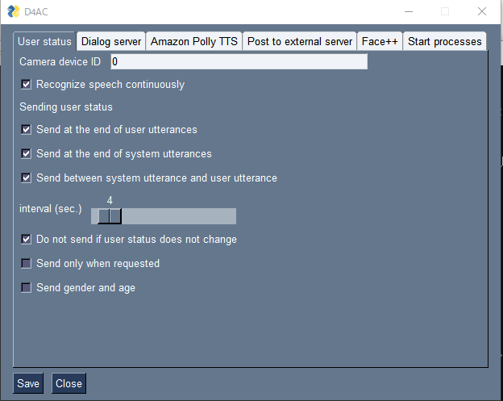
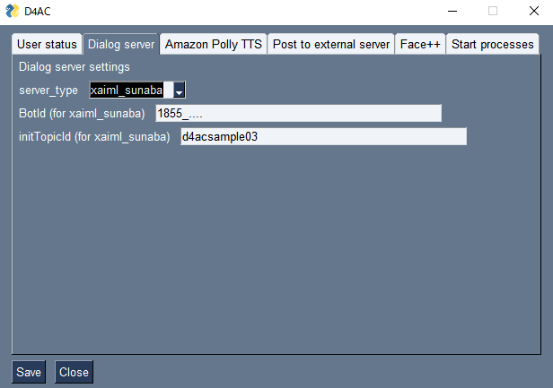
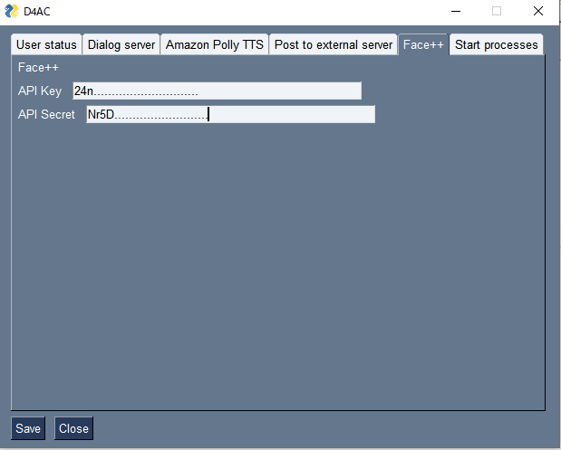
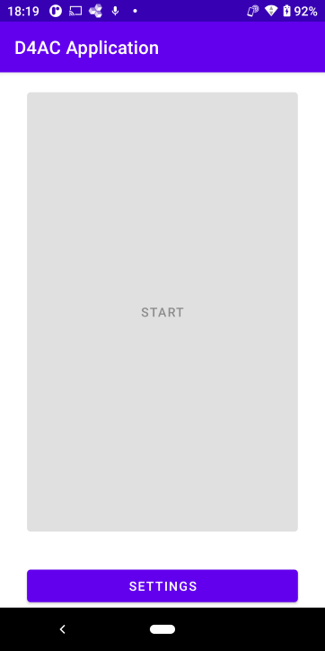

# D4AC: A tool for building multimodal dialogue systems

[日本語版](README-ja.md)

ver 1.0.1

## Overview

D4AC (Dialogue for All-Client) is a client (multimodal input/output part) of D4A (Dialogue for All), a tool developed at Nagoya University that allows non-experts to easily build multimodal dialogue systems.

It works as a client of the dialog server built and operated by NTT DoCoMo's [xAIML SUNABA](https://docs.xaiml.docomo-dialog.com/#) or C4A Research Institute, Inc.'s [DialBB](https://github.com/c4a-ri/dialbb). 

After lauching the dialog server and D4AC, you can connect to D4AC from Chrome on the PC where D4AC is running or an Android device.
(Currently, we do not distribute an application for Android. If you need it, please contact us.)

It is possible to create a dialogue system that changes its behavior depending on the engagement level estimated from the recognition results of the user's facial image, or on the user's state.

 D4AC has been tested in the following environments.

- OS: Windows 10 Pro 64bit
  
  Python for Windows 3.9.9
  
  Google Chrome version: 89.0.4389.114

- OS: Windows 11 Pro 64bit
  
  Python for windows 3.10.2
  
  Google Chrome version: 107.0.5304.107

- OS: Mac OS 12.6.1 (Apple M1)
  
  Python for Mac 3.9.10
  Goole Chrome version: 107.0.5304.87

The following services are available for estimating user state estimation results.

- [Face++](https://www.faceplusplus.com/).
  - It corresponds to the degree of dialogue participation, age, gender, and emotion recognition.

- [Mediapipe FaceMesh](https://google.github.io/mediapipe/solutions/face_mesh). (Windows only)
  - Only the degree of dialogue participation is supported.

When using the system from a PC via Chrome browser, any common camera, microphone, and speakers can be connected to the PC.

In the case of an Android application, the camera, built-in microphone, and speaker on the front of the monitor are used.

An Internet connection is required to install D4AC.

Please refer to [developer documentation](docs/developer-document.md) (currently only in Japanese) for technical details on D4AC and how to modify it.

## Notes

D4AC sends the user's facial image and voice to a cloud-based image and voice recognition system managed by a private company. Therefore, there is a risk of personal information leakage, and users should be informed of this before using systems built using D4AC, and consent should be obtained appropriately.

In addition, estimating emotions from facial images and linking them to the content of the dialogue may, depending on how it is used, risk gaining an inside view of the individual that is not intentionally disclosed by the user. This should be used with caution.

## Installation

To install D4AC, you need to install python, install packages, install mosquitto, and configure mosquitto.

### Installing python

There are several ways to install python. The following is a description of the most common ones.

- Windows
  
  - Install Python for Windows from   [https://www.python.org/downloads/windows/](https://www.python.org/downloads/windows/).
  
  - We have confirmed that it works with Python for Windows 3.9.9, but it may work with 3.8 or higher.
  
  - Remember to check the "Add Python 3.x to PATH" box on the first screen of the installation.
  
- Mac

  - Installing brew
  - See  [https://brew.sh/](https://brew.sh/)
  
- Installing   python
  
  - Installing Python3 on Mac with brew.
  
    ```sh
    	brew install python-tk
    ```
  
- Install `python-tk`,   not `python`. Otherwise, the GUI will not be displayed.

### Install D4AC package

- Downloading the whl file.

  - Click on the file `d4ac-x.x.x-py3-none-any.whl` on the   [distribution page](dist), open it, and then click the down arrow in the upper right corner to download. After downloading, move the file to an appropriate folder.

- Installing packages

  Open a command prompt (terminal on a mac), go to the folder where the whl file is located, and enter the following command.

  ```sh
  pip install <name of downloaded whl file>. 
  ````

  - Replace `<name of downloaded whl file> ` with the name of the downloaded whl file.

  - Depending on your Python installation, it may be `pip3` instead of `pip`.

  - Entering the above command will automatically download and install the necessary packages from the Internet.

### Installing mosquitto

To engage in a dialogue using user state estimation results, you need to install the MQTT service called mosquitto.

Follow the steps below to install mosquitto.

- Windows
  
  - Download binaries for Windows from   [https://mosquitto.org/download/](https://mosquitto.org/download/)
  
    - It is located in the Windows section of Binary Installation.
  
    - Please select  64-bit or 32-bit build according to your computer's operating system.

  - Double-click the downloaded file to open and install. It is okay to select the default settings for everything.
  
  - Press the Ctrl, Alt, and Delete keys simultaneously and click on "Task Manager".

  - Click on the "Services" tab, place the cursor over the name mosquitto, right-click, and select "Start". Select "Start".
  
- Mac
  
  - Follow the steps below to install and start the software.
  - Open a terminal.
  - If you have not installed   [brew](https://brew.sh/index_ja), install it from the Internet.
  - After installation, perform the following
  
  ```sh
    brew install mosquitto
  ````
  
  Start mosquitto with the following command.
  
  ```sh
    /opt/homebrew/opt/mosquitto/sbin/mosquitto -c /opt/homebrew/etc/mosquitto/mosquitto.conf
  ````

### Setting up Mosquitto when using Android

If you are using Android, open`/c:\program files\mosquitto\mosquite.conf` on Windows, or `/opt/homebrew/etc/mosquitto/mosquitto.conf` on Mac with a text editor (e.g. Notepad), add the following items, and save the file.

  ```txt
  Listener 1883
  allow_anonymous true
  ````

## Startup

Open a Windows command prompt or a Mac terminal, and type the following.

```sh
d4ac
````

Then you can launch the configuration screen by entering the following command. You can type the command in any directory (folder) .

### D4AC setup screen

When D4AC is started, the setup screen appears. There, you can configure various settings, start up the system, and close it.

#### Common items

| Button | Description|
|-----|------|
| Save | Writes the configuration to the YAML file. The settings will not be applied until you click this button. |
| Close | Exits the program. The running D4AC-related programs are also terminated. |

#### User states tab



| Item | Description|
|-----|------|
| Camera device ID | An integer greater than or equal to 0 indicating the camera device ID. |
| Recognize speech continuously | Check this box if you want to perform speech recognition continuously, including during system speech. This checkbox is disabled for Android applications. |
| Send at the end of user utterances. | Send the user state estimation results at the end of user utterances. |
| Send at the end of system utterances | Send the user state estimation results at the end of system utterances. |
| Send between system utterance and user utterance | Sends the result of user state estimation when the user has not spoken for a certain period of time after the system utterance has ended. |
| interval (sec.) | Transmission timing of user state estimation results in the case of the above setting (sec.)|
| Do not send if user states does not change | In the above case, if the result of user states estimation does not change, do not send. |
| Send only when requested | If the setting is to send the user state estimation result at the end of system utterance or when the user has not spoken for a certain period of time after the end of system utterance, the user state estimation result is sent only when the request from the dialog management section (sent at the same time as the system utterance) is matched. The user state estimation result is sent only when it matches the request from the dialog management section (which is sent at the same time as the system utterance). |
| Send gender and age | Send the gender and age estimation results when sending the user state estimation results. |

#### Dialog server tab




| Item | Description|
|-----|------|
|server_type | You can switch the server type. Currently, `xaiml_sunaba`, `dialbb`, `dummy_dialog`, and `test_dialog` are available (see below). |
| Botid | Botid when using sunaba|
| initTopicId | initial topicid when using sunaba|

#### Amazon Polly TTS tab

This is for the setup for speech synthesis using Amazon Polly.

identity PoolId and region. To obtain these, you will need to obtain and set up an AWS account, which can be found on [this page](https://docs.aws.amazon.com/ja_jp/sdk-for-javascript/v2/developer-guide/getting- started-browser.html), but it requires technical knowledge, so please ask someone familiar with the subject.

Currently only Japanese male voice (Takumi) can be used. 


| Item | Description|
|-----|------|
| identityPoolId | identityPoolId of amazon polly|
| region | amazon polly's region|

#### Post to external server tab

Configure the dialog server to send the processing results to an external server.


| Item | Description|
|-----|------|
| Post dialog server outputs to the external server | Whether to send dialogue server outputs to external server. |
| External server URL | External server destination URL |

#### Face++ tab



| Item | Description|
|-----|------|
| API key | tAPI key for Face++. |
| API Secret | API Secret for Face++. |

See [here](docs/facepp.md) for information on how to obtain the API Key and API Secret for Face++.

#### Start processes tab

Starts the modules.


| Item | Description|
|-----|------|
| IP address of this PC | This is the IP address that the Android application uses to connect to the PC. |
| Path of D4AC package | The destination path of the D4AC package you are running. This is the path to the D4AC package where you want to save the interactive image. |
| dialog_server | Start/stop the dialog_server (dialog server). |
| d4ac_main | Start/stop d4ac_main (main program). |
| video_input | Start/stop video_input (camera image input) Start only when using Chrome. |
| face++ (Face++ user state estimation) is started and terminated. | Start/stop Face++ (Face++ user state estimation) |
| mediapipe | Start/stop mediapipe (mediapipe user state estimation). (available for windows only) |
| userstates | Start/stop userstates (a module that estimates engagement from mediapipe results) |

When each program is started, `running` is displayed on the screen. The running program can be stopped by pressing the `stop` button.

### System startup

- When using Chrome

  Select the `Start processes` tab on the configuration screen and start the necessary processes from there.

  `dialog_server` and `d4ac_main` must be started.

  To perform user state estimation from images, start `video_input` and then either `face++` or `mediapipe` (Windows only). It takes quite a while (about 1 minute) for the image input screen to appear.

  When using `mediapipe`, `userstates` must also be activated.

  After launching, run chrome and connect to `http://localhost:8000/`, a menu will appear on the screen.

  | Contents | Description
  |-----|------|
  |Chrome Speech Synthesis| This will be the spoken dialogue mode that uses Chrome Speech Synthesis. (This is selected initially.) |Chrome Speech Synthesis
  |Amazon Polly |Enables spoken dialogue mode using Amazon Polly speech synthesis. |Amazon Polly
  |Text IO |Text input/output mode. |Text IO

  Click `Start Dialog` on the   Utterance screen to start the dialogue.

  User state estimation results cannot be sent on the Text IO screen.

  To resume the dialogue, press the reload button on your browser.

- If you want to use the android D4AC client app on the front end instead of Chrome

  - Install the apk file on your android. (The installation method differs depending on the OS, so please check the settings of your android OS.)
  - The android D4AC client application acquires the facial image and sends the facial image data to the user state estimation result program on the PC side, so the video_input of the above activation method is not activated.
  - Connect the   android device to the same network as the PC running D4AC via wifi, etc. Please ask your network administrator how to join the network.
  - If your   Windows is configured with a firewall such as anti-virus software, you will not be able to connect to the MQTT network from outside. Please disable it temporarily or change the setting so that MQTT port 1883 can be accessed from the outside.

    Note the four numbers separated by commas that appear in the IP address of this PC in the D4AC GUI's system startup. This value may change, so please check it before connecting to android.
    If you cannot connect with that IP or are not sure, check the network settings with your system administrator to obtain IP address information.

  - Launch the d4ac application on android.
  - All security warnings should be allowed.
  - The following screen is displayed.

  

  - The following screen will appear.

  

  - Enter the above IPV4 address in the   Server address field.
  - Enter 8000 for the   Server http port.
  - Once you have entered the information, click the Back button to exit the application and reopen it. If the setting is successful, you will be able to press the Start button.
  - Press the   Start button to display the facial image and enter the voice input state.
  - The application can be closed by pressing the Back button.

## Stop

In the `System Startup` tab of the D4AC application, exit the running programs individually, or click the `Close` button in the lower left corner of the GUI.

## Communicate with Dialogue Server

### Server Type of Interactive Server

You can choose from `xaiml_sunaba`, `dialbb`, `dummy_dialog`, or `test_dialog` as the dialog server type.

- `xaiml_sunaba` uses NTT Docomo's [xAIML-SUNABA](https://docs.sunaba.docomo.ne.jp/) as a dialog server.

- `dialbb` uses [DialBB]() of C4A Research Institute as a dialog server. 
- `dummy_dialog` uses a dialog manager that returns a large portion of the dialog. This is for checking the operation.
- test_dialog is for developer testing and is not normally used.

### Configure each type of server

- xAIML SUNABA
  - After running the xAIML SUNABA application, set the `botID` and `initTopicID` in the `Dialog server` tab of the D4AC configuration screen.
    Please refer to [xAIML-SUNABA documentation](https://docs.sunaba.docomo.ne.jp/documentation/) for more information on these.
- DialBB
  - Run the DialBB web application on port number `8080`. 

### Sending user state estimation results 

There are four types of user states

| Type | Value
| ---------- | ------------------------------------------------------------ |
| engagement | "high", "middle", or "low" | "high", "middle", or "low" | "low
| emotion    | "anger", "disgust", "fear", "happiness", "neutral", "sadness", or "surprise".
| age        | "child", "teenager", "young", "middle", "senior", or "unknown" |
| gender | "male" or "female" |

#### For xAIML-SUNABA

The user state estimation results are sent in the following format

- At the end of user speech: The message is sent after the user speech.

  ````
  hello+{engagement:high}{emotion:happiness} # Send at the same time as user speech at the end of user speech
  hello+{engagement:high}{gender:male}{age:child} # Send at the same time as user speech at the end of user speech (when gender and age are also sent)
  ````

- At the end of system utterance: display the result of user state estimation with a + after su-end.

  ````
  su-end+{engagement:high}{emotion:happiness} # Send at the end of system speech
  su-end+{emotion:happiness}
  ````

- After the end of the system utterance and until the user utterance, the user state estimation result is displayed with + after the silence.

  ````
  silence+{engagement:middle}{emotion:anger} # Send during silence interval after system speech ends
  silence+{engagement:low}
  ````

  User state estimation results are always in the order of engagement, emotion, gender, and age.

#### For DialBB

The result of the user state estimation is sent in the `"aux_data"` of the request to the DialBB server in the following format.

```json
{
    "engagement": "high", 
    "emotion": "happiness",
    "gender": "male", 
    "age": "child"
}
````

If your DialBB app uses the STN Manager built-in block, you can refer to it in your scenario as `#engagement`, `#emotion`, etc.

The value of `"user_utterance"` in the request is `""` (empty string) at the end of the system utterance or between the end of the system utterance and the user utterance.

### Displaying images during dialogue

If the system speech string ends with "(<image filename>)", the relevant image file in the image folder is displayed, also in the D4AC android client. The image folder is the `image` folder in the `static` folder in the `d4ac_main` folder in the D4AC system folder, which is displayed in the `Start process` tab of the D4AC GUI.

Example: If the system speech is `"That's interesting (oowarai_man.png)`, then `{D4AC system folder name}\d4ac_main\static\images\oowarai_man.png` is displayed.


### How not to let the system speak

If you do not want the system to speak anything, specify `"empty"` for system speech in the dialog server response.

### Request to send user state estimation results

If "`Send only when requested`" is checked in the User states tab of the configuration screen, the sending of user state estimation results after the end of system speech and before the start of user speech after the end of system speech is performed only when a request from the dialog server is matched. The transmission of user state estimation results after the end of system speech and before the start of user speech is performed only when a request from the dialog server matches.

The request is written after the system speech string in the following format.

````
[<type>:<value>].
````

The type is one of `emotion`, `engagement`, `age`, `gender`, or several of them concatenated as `emotion|age`. The value is a user state value. The value is a list of user state values separated by `|`.

For example, `happiness|sadness|low` or `anger`.

As an example, the

````
How are you feeling today? [emotion|engagement: happiness|sadness|high]
````

The request can be made by sending a system speech string from xAIML-SUNABA such as This request part is not used for speech synthesis or screen display.
After this, only when the emotion becomes happiness or sadness after the system speech ends, the dialog server is notified

````
su-end+{emotion:happiness}
silence+{engagement:sadness}
````

Otherwise, nothing is sent. 

## Send output from dialogue server to external server (for experts)

The response from dialog_server can be forwarded to an external server and the results returned to the user.

Sends the JSON format in the following form to an external server at the specified URL using the POST method.

```json
{
  "systemUtterance":{"expression": system_utterance, "utterance": system_utterance}
  "talkend": false,.
  "timestamp": <string of timestamp>.
}

````

The sample code for the external server implementation (omuResponse) is in `dummyResponse` in `src/sampleExtServer/urls.py`. Since it is a dummy response, there is no change even if you execute and configure it.

When using an external server, set up a customized external server based on `dummyResponse`.

If not used, the external server transmission function must be turned off for proper operation.

## Acknowledgements

The development of D4AC was supported by [Graduate Program for Lifestyle Revolution based on Transdisciplinary Mobility Innovation  (TMI Program)](https://www.tmi.mirai.nagoya-u.ac.jp/en/). We would like to express our gratitude to all parties involved.

## Citation

Please cite the following references when publishing results using D4AC.

- Mikio Nakano and Ryuichiro Higashinaka, [D4AC: A Multi-modal Dialogue System Development Tool for Interdisciplinary Collaboration](https://www.jstage.jst.go.jp/article/jsaislud/99/0/99_172/_article/-char/ja), JSAI SIG-SLUD, vol. 99, pp. 172-177, 2023 (in Japanese)

## License

[Apache 2.0](LICENSE)

## Contact

Email: `d4ac` at `ds.is.i.nagoya-u.ac.jp`.

## Copyright

Copyright, Nagoya University
