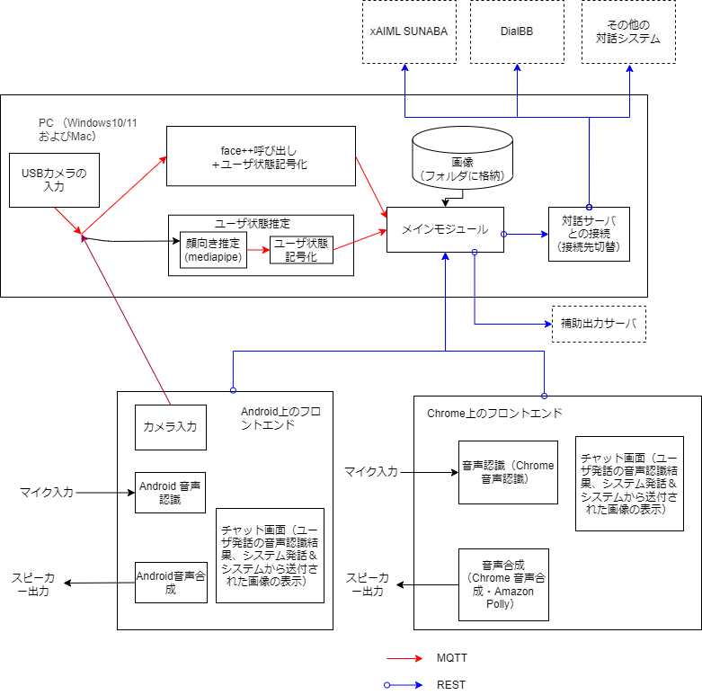

# マルチモーダル対話システム構築ツール マルチモーダル入出力部 D4AC 開発者用ドキュメント

ver 0.1.0

## 概要

D4AC (Dialogue for All-Client)は名古屋大学で開発されている，マルチモーダル対話システムを非専門家でも簡単に構築できるツール，D4A (Dialogue for All)のクライアント（マルチモーダル入出力部）である．

D4ACは，音声認識結果を対話サーバに送信し，対話サーバから応答文字列を受信して音声合成により発話を行う．また，カメラで取り込んだユーザの画像から，ユーザの状態を推定し，対話サーバに送信することで，ユーザの状態に応じた対話を行うことが可能になる．

D4Aは情報系の専門家ではなくても使えることを企図している．D4ACは，非専門家が簡単に実行できるPythonパッケージとして動作する．

本ドキュメントは，D4ACのインストール，開発環境での起動方法，および，配布用パッケージの作成方法を説明する．Pythonの知識がある読者を対象にしている．[README](../README.md)に書いてあるD4ACの利用方法を読んでいることを前提としている．

D4ACではユーザ状態推定のためにazure face++, mediapipe (Windowsのみ）のどれかをを用いることができる．

- face++は現在は無料のライセンスを想定しているため，判定速度，判定回数に制限がある．必要があれば有料ライセンスに移行すること．
- mediapipeは現在Appleシリコンに対応していない．そのためWidowsのみ動作可能となっている．


## インストール

- Pythonのインストール

  一般的な方法でPythonをインストールする．

- D4ACのclone

  本システムをgithubからcloneする．D4ACフォルダができる．

- Poetry のインストール

  pythonのビルドツールとして[poetry](https://github.com/python-poetry/poetry)を使用している． 下記の方法で`poetry`をインストールする．

  windows の場合，PowerShellにて下記コマンドを入力してインストールする．

  ```cmd
  (Invoke-WebRequest -Uri https://install.python-poetry.org -UseBasicParsing).Content | py -
  ```

  パスが通ってない場合は，poetryのディレクトリ（通常：%APPDATA%\Python\Scripts）をPATHに追加する必要がある．

  Macの場合，コマンドラインで次のコマンドを実行する．

  ```sh
  curl -sSL https://install.python-poetry.org | python3 -
  ```

- 開発環境のインストール

  poetry インストール後，D4ACをインストールしたフォルダにて，下記のコマンドを実行する．必要なライブラリがpoetryの仮想環境にインストールされる．

  ```sh
  poetry install
  ```

  上記のコマンドにて依存関係のエラーが発生した場合は，次のコマンドを入力する．必要なライブラリがアップデートされる．

  ```sh
  poetry update package
  ```

- Mosquittoのインストールと開始

  READMEを参照のこと．

## 開発環境での動作確認

コマンドプロンプト/ターミナルで，D4ACをインストールしたフォルダに移動し，

```sh
poetry shell
```

を実行すると，Pythonの仮想環境がコマンドプロンプト/ターミナル内で立ち上がる．以降の説明は，この環境にて動作させることを前提とする．

インストールした環境によっては，コマンド名がpythonではなく，python3の場合がある．その場合，以下のコマンド全て`python`を`python3`に置き換えること．

またWindowsの場合は'`/`'を'`\\'に変更する必要がある．

### GUIから起動する方法

```sh
python src/d4ac.py
```

を実行するとGUIの画面が表示される．GUI設定ファイルの編集や，各モジュールの起動，終了ができる．GUIの操作方法はREADMEを参照．

Windowsの場合，開発者用の環境ではGUIでは各モジュールの終了をさせることができない．各モジュールを終了させるには，コマンドプロンプト/ターミナル自体を閉じるか，Control-Cを数回打つ．

### 各モジュールをコマンドラインから起動する方法

各モジュールをGUIから起動せず、コマンドラインから起動させることもできる

- 画像取り込みサブモジュールの起動（ユーザ状態を送信しない設定または，androidクライアントの場合は起動不要）

  ```sh
  cd src/video_input
  python video_input.py
  ```

  カメラの画像を表示するウインドウが表示される．

下記の3つのユーザ状態推定結果取得プログラムのうちどれかひとつを起動する．

- face++ を使用する場合
  
  ```sh
  cd src/facepp
  python face_emotion.py
  ```
  
- mediapipe （Windowsのみ）を使用する場合

  次の二つのコマンドを実行する．

  ```sh
  cd src/mediapipe
  python mesh.py
  ```

  ```sh
  cd src/user_status
  python user_status.py
  ```

下記プログラムは必ず起動すること．

- サンプル対話サーバの起動

  別のWindowsコマンドプロンプトを開き，D4ACフォルダに行き，以下を実行する．

  ```sh
  cd src/dialog_server
  python dialog_server.py
  ```

- メインプロセスの起動

  別のWindowsコマンドプロンプトを開き，D4ACフォルダに行き，以下を実行する．

  ```sh
  cd src/di4ac_main
  python d4ac_main.py
  ```

### 対話の開始

- Google Chromeブラウザから`http://localhost:8000`にアクセスする．

  「Start Dialog」のボタンを押して対話をスタートさせる。  

   Chrome以外のブラウザでは動作しない．

## 配布用プログラムの作成


D4ACフォルダにて

```sh
poetry build
```

を実行すると `dist/d4ac-x.x.x-py3-none-any.whl`が作成される．
このファイルをpipコマンドでインストールすることができる．（ユーザドキュメント参照） 

## 設定

### Configuration

  設定GUIはsrc/config.ymlを読み込む。src/config.ymlがない場合は、src/config-template.ymlを読み込む。最初はsrc/config.ymlは存在しない。
  設定を保存したときは、src/config.ymlに書き出す。

  例

  ```yaml
amazon_polly:
  identityPoolId: ap-northeast-1....
  region: ap-northeast-1
continuous_voice_recognition: true
dialog_server:
  botId: 1855_....
  initTopicId: d4acsample03
  port: 8080
  server_type: dummy_dialog
facepp:
  apikey: ....
  secret: ....
post_server:
  enable: false
  url: http://localhost:8888/dummyResponse/
server_port: 8000
user_status:
  on_request: false
  send_gender_and_age: false
  silence:
    only_upon_changes: true
    period: 4.0
    send: false
  su_end:
    send: false
  uu_end:
    send: false
video_input:
  device_id: '0'
  ```

 src/config.ymlの説明

| フィールド                   | 値のタイプ | 説明                                           |
| ---------------------------- | ---------- | ---------------------------------------------- |
| amazon_polly                 | object     | amazon polly音声合成に関する情報（説明省略）   |
| continuous_voice_recognition | boolean    | システム発話中にも音声認識するかどうか         |
| user_status                  | object     | ユーザ状態推定結果送信（以下説明）             |
| dialog_server                | object     | 対話サーバの情報（以下を参照）                 |
| server_port                  | int        | d4acのserverのポート番号（デフォルト値：8000） |
| video_input                  | object     | 画像入力の情報（説明略）                       |

  対話サーバの情報

| フィールド  | 値のタイプ | 説明                                                         |
| ----------- | ---------- | ------------------------------------------------------------ |
| server_type | string     | "xaiml_sunaba", ”dialbb", "dummy_dialog", "test_dialog"のどれか |
| aiml_file   | string     | server_typeがaimlの場合に用いられるaimlファイル.  src/dialog_serverからの相対 |
| botId       | string     | server_typeがxaiml_sunabaの場合のbotId                       |
| initTopicId | string     | server_typeがxaiml_sunabaの場合のinitTopicId                 |

  ユーザ状態推定結果の情報

| フィールド  | 値のタイプ | 説明                                                          |
| ----------- | ---------- | ------------------------------------------------------------ |
| on_request | boolean | システム発話終了後およびシステム発話終了後から音声認識開始までの間にユーザ状態推定結果を送信するかどうかを，対話サーバのリクエスト（直前のシステム発話と同時に送られてくる）に応じて決める |
| send_gender_and_age | boolean     | 最初に性別と年齢を送信するかどうか                               |
| silence.only_upon_changes   | boolean     | 変更があったユーザ状態推定結果のみ送信する |
| silence.period       | number     | 送信間隔(秒)          |
| silence.send | boolean     | システム発話終了後から音声認識開始までの間に定期的にユーザ状態推定結果を送信する． |
| su_end.send | boolean | システム発話終了後にユーザ状態推定結果を送信する |
| uu_end.send | boolean | ユーザ発話終了後にユーザ状態推定結果を送信する |

## 対話中の画像表示

システム発話文字列の最後に"(<画像ファイル名>)"がある場合，src/d4ac_main/static/imagesのファイルを表示する．

例：`"それは面白い (oowarai_man.png)"`

## モジュール構成



### 各モジュール詳細

#### ユーザ状態推定

- モジュール間はMQTTで非同期通信を行う

- MM対話フロントエンドからの要求に応じてユーザ状態を送信

- 各サブモジュールはPythonで構築されている

##### 画像取り込みサブモジュール

- PCのカメラ画像をリアルタイムで取り込む

- 取り込んだ画像を定期的にMQTTで顔向き推定モジュールまたは，face++に送る

- publish時のtopic: `dialog/image`

#### MM対話フロントエンド

- Chrome上で動作するJavaScriptプログラム. Vue.jsを利用している．

- 処理の詳細

  - マイク入力の結果をWeb Speech APIを用いて音声認識
  - 対話サーバからの応答結果をWeb Speech APIを用いて音声合成する
  - 制御はd4ac_mainモジュールより，config.ymlの内容を読み取り，動作を変更している


#### メインモジュール

- MM対話フロントエンドからユーザ発話の音声認識結果を受理したとき，
    ユーザ状態をユーザ状態記号化モジュールからMQTT経由で取得し，音声認識結果と共に対話サーバに送る
- MM対話フロントエンドからシステム発話終了の情報を受理したとき，
    ユーザ状態をユーザ状態記号化モジュールからMQTT経由で取得し，対話サーバに送る
- 対話サーバから応答テキストを受け取ってMM対話フロントエンドに送る
- Python FastAPIで構築．MM対話フロントエンドからみて，REST APIサーバとして動作する．

#### 対話サーバ

- xAIML-SUNABA，DialBB，dummy dialog (オウム返し），test dialog（開発テスト用）との通信モジュールが用意されている

#### Android D4AC クライアントアプリ

- 画像取り込みサブモジュールと，MM対話フロントエンドの機能をアンドロイドのアプリで実行するモジュール
- 実際の動作概要は画像取り込みサブモジュール，MM対話サブモジュールの項目を参照．
- 動作の説明はユーザドキュメントを参照．
- コードの説明はandroidフォルダのReadme.mdファイルを参照.

#### facepp

- [face++](https://www.faceplusplus.com/)を利用
- 画像取り込みサブモジュールまたはandroidのアプリから顔画像情報を取り込みFace++に送信すると
  顔情報が返ってくるので，記号化を行い送信する．
- 現在は無料APIの都合上，入力画像を間引いている．
- 表情認識については，APIから帰ってきた確率が一番高いデータを送信している．
- 顔向き判定はapiから顔角度が返ってくるので，簡単な判定で結果を返している．
- publish時のtopic: `dialog/user_status`
- face++のライセンスキーはfreeのライセンスを使用している．freeのため時間あたりの使用回数に制限がある．

#### mediapipe

- [mediapipe](https://google.github.io/mediapipe/)の[Face mesh機能](https://google.github.io/mediapipe/solutions/face_mesh)を使用して，顔の特徴点を取得し，顔向きデータを取得する．
- userstatusモジュールが対話参加度を計算している．

#### ディレクトリ構造

```txt
├── docs            # ドキュメント
└── src
    ├── input_video           # 画像取り込みサブモジュール
    ├── android               # android クライアントソース  
    ├── facepp                # faceppモジュール
    ├── Google Apps Script    # 外部DB用GASスクリプト
    ├── mediapipe             # mediapipeモジュール
    ├── user_status           # user_statusモジュール
    ├── d4ac_main             # メインモジュール
    ├── frontend              # MMクライアント
    ├── dialog_server         # 対話サーバ
    ├── keyword_table_upload  # 外部DBアップロードプログラム
    ├── keywordserver         # 外部DBサーバサンプル実装
    ├── mac                   # mac用ツール
    └── util                  # 共通utitlity
```

#### ログファイル

ログファイルは，ホームディレクトリの`d4ac`フォルダにある．

### モジュール間通信仕様

#### メインモジュールと対話サーバの間の通信

- メインモジュールから対話サーバへの出力（最初のアクセス）

  ```json
  {"initial": true,     # 最初のアクセスかどうか
   "userStatus": {
      "engagement": "0" # ("0", "1", "2") 数字ではなく文字列
      "emotion": "anger" # 感情を表す文字列
    }，
    "timestamp" : "2015-05-05 13:30:00"
  }
  ```
  
- メインモジュールから対話サーバへの出力（最初以外）

  ```json
  {"initial": <bool: 最初のアクセスかどうか>
    "userUtterance": <str: 発話の音声認識結果>
    "sessionId": <str: sessoin id>,
    "userStatus": {
       "engagement": <str: "high", "middle", or "low">
       "emotion": <str: "anger", "contempt", "disguest", "fear", "happiness", "neutral", "sadness", or "surprise">
       "age": <str: "child", "teenager", "young", "middle", "senior", or "unknown">,
       "gender": <str: "male" or "female">,
    }
    "timestamp": <str: timestamp>
  }
  ```

  "emotion"の値の"contempt"はface-apiのみでface++にはない．

  対話サーバへの出力は，設定に従い、ユーザ発話の音声認識終了時、システム発話終了時、システム発話終了後ユーザ発話開始前一定間隔で行われる．
  ユーザ発話の音声認識終了時以外は，"userUtterance"の値は空文字列になる．

- 対話サーバからメインモジュールへの入力

  ```json
  {
    "sessionId": "3aIgs8x6ow",
    "systemUtterance": {
      "expression": "どこで食べようか？", #表示用
      "utterance": "どこで食べようか？"   #音声合成用
    },
    "talkend": false,  # 対話の終わりかどうか
    "timestamp": "2017-07-25 13:31:00"
  }
  ```

## フロントエンドの変更

Chromeのweb画面は`src/frontend/`以下にソースコードが存在している．

ソースコードはvue2でビルドされているので，web画面を変更した際には，以下の手順で再コンパイルする．

### node.jsのインストール

[node.jsのホームページ](https://nodejs.org/ja/)からLTS版をインストール

### vue-cliのインストール

```sh
npm install -g @vue/cli
```

### packageのインストール

```sh
npm install
```

### Compiles and minifies for production

```sh
npm run build
```

### サーバへのhtml,jsファイルのコピー

ビルドしたファイルをd4ac_mainにコピーして，`d4ac_main`起動時に反映させるようにする．

windowsの場合

```cmd
cd src/frontend/
install.bat
```

macの場合

```sh
cd src/frontend/
./install.sh
```


