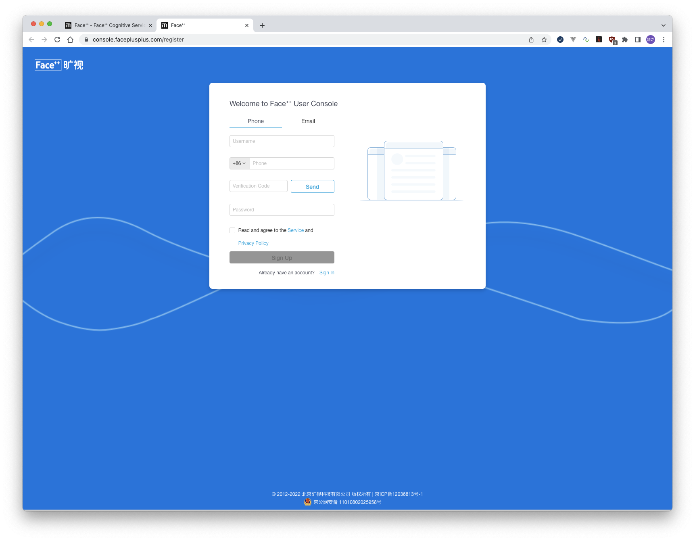
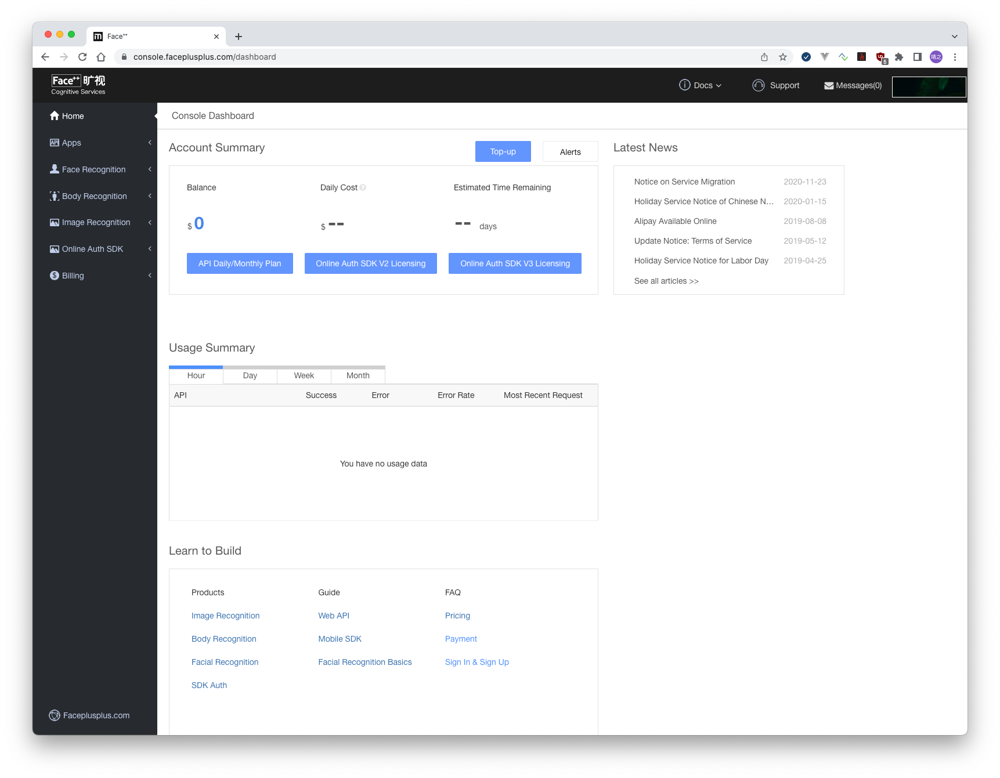
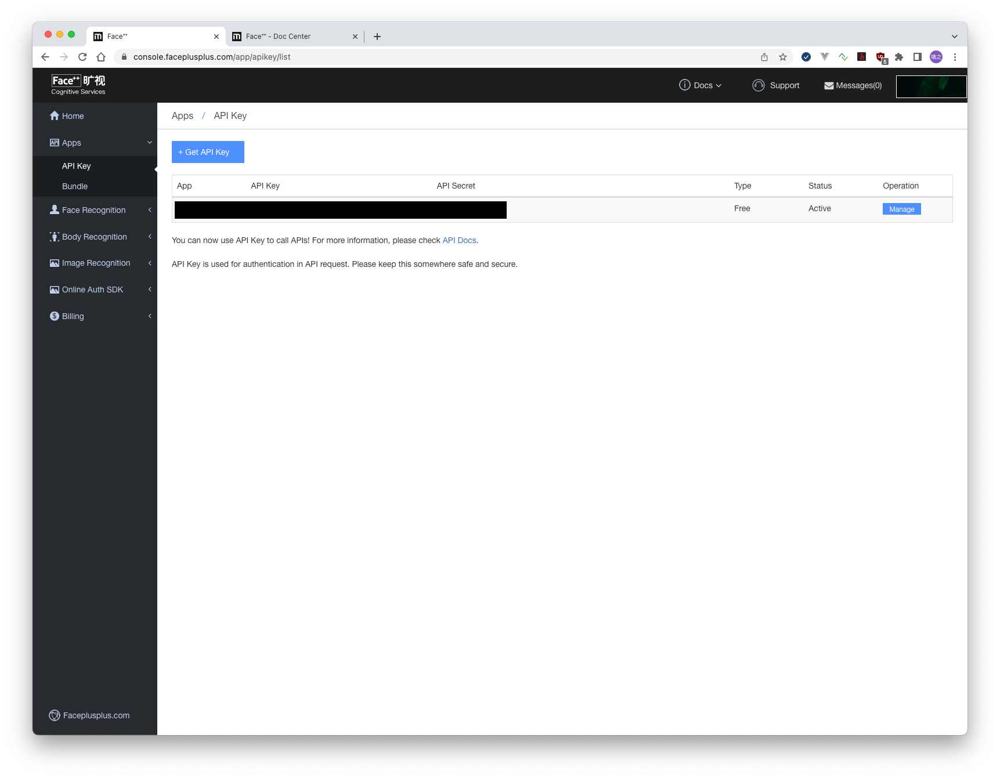

# face++のライセンスの取得方法

- face++のライセンスキーが必要な場合は，face++にユーザ登録する必要がある．以下の方法を参考にすること．

- [https://www.faceplusplus.com/](https://www.faceplusplus.com/)にアクセスして，右上のサインアップをクリックする．
  
  次のような画面が表示される
  
  必要事項を入力する．（電話は携帯番号で先頭の0を除く，sendをクリックしてverification codeを取得して入力すること）
  
  ユーザ登録ができたら，再度トップ画面のコンソールを開く．
  
  Apps/API Key を選択
  
  Get API Key または，表示されているキー情報を取得する．

